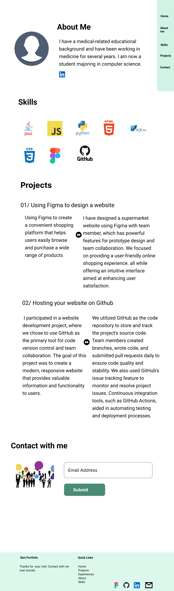

figma porfolio screenshot

My Figma Project - [here](https://www.figma.com/proto/zdvHG3Abqqt2mcHAShyULf/Untitled?type=design&node-id=1-194&t=hONBVMmBBpo941oO-0&scaling=min-zoom&page-id=0%3A1&starting-point-node-id=1%3A216)

GitHub Pages: 
- first page - [here](https://nani1345.github.io/nani-midterm-1103/index.html#section-home)
- second page - [here](https://nani1345.github.io/nani-midterm-1103/index2.html#section-project)

Github reporsitory-https://github.com/Nani1345/nani-midterm-1103.git

